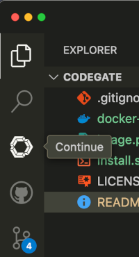

# Continue Setup Guide

First off all, you will need to install the Continue Extension. 

You can do this by running the following command:

```bash
code --install-extension continue.continue
```

Alternatively, you can install the extension from the [Visual Studio Code Marketplace](https://marketplace.visualstudio.com/items?itemName=Continue.continue).


Once you have installed the extension, you should be able to see the Continue icon in the Activity Bar.



## Steps to Complete Setup

### 1. Configure Continue

Within VSCode open the command palette and run the `Continue: New Sesstion`

This will bring up the Continue chat window. 

Select the cog icon in the top right corner to open the settings.

Configure your LLM provider as per normal with Continue, but change the `apiBase`
value as follows:

```json
{
  "apiBase": "http://localhost:8989/openai",
  }
}
```

For example, to configure the Anthropic provider, you would use the following configuration:

```json
{
  "title": "anthropic claude-3-5-sonnet",
  "provider": "anthropic",
  "model": "claude-3-5-sonnet-20241022",
  "apiKey": "yourkey",
  "apiBase": "http://localhost:8989/anthropic"
},
```

The same follows for OpenAI, Ollama, vLLM and any other provider you wish to use.

```json
"models": [
    {
      "title": "vllm-qwen2.5-coder-14b-instruct",
      "provider": "vllm",
      "model": "Qwen/Qwen2.5-Coder-14B-Instruct",
      "apiKey": "key",
      "apiBase": "http://localhost:8989/vllm"
    },
    {
      "title": "openai",
      "provider": "openrouter",
      "model": "gpt-4o-2024-11-20",
      "apiBase": "http://localhost:8989/openai",
      "apiKey": "key"
    },
    {
      "title": "anthropic claude-3-5-sonnet",
      "provider": "anthropic",
      "model": "claude-3-5-sonnet-20241022",
      "apiKey": "key",
      "apiBase": "http://localhost:8989/anthropic"
    },
    {
      "title": "ollama qwen2.5-coder-7b-instruct",
      "provider": "ollama",
      "model": "sammcj/qwen2.5-coder-7b-instruct:q8_0",
      "apiBase": "http://localhost:8989/ollama"
    }
  ],
```

For auto completion, you can add the following to your settings.json file:

```json
"tabAutocompleteModel": {
  "title": "ollama",
  "provider": "ollama",
  "model": "codellama:7b-code",
  "apiBase": "http://127.0.0.1:8989/ollama"
},
```

You can now start using Continue as before, but with the added benefit
extra privacy and control over your data.


## Support

Any issuess , please ask for support on the Continue [CodeGate Discussions](https://github.com/stacklok/codegate/discussions/categories/continue) page.

