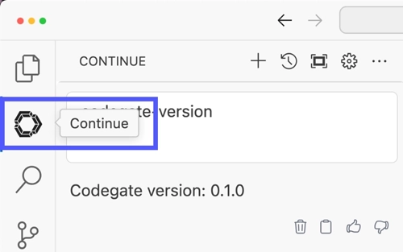
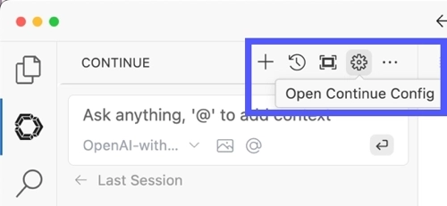
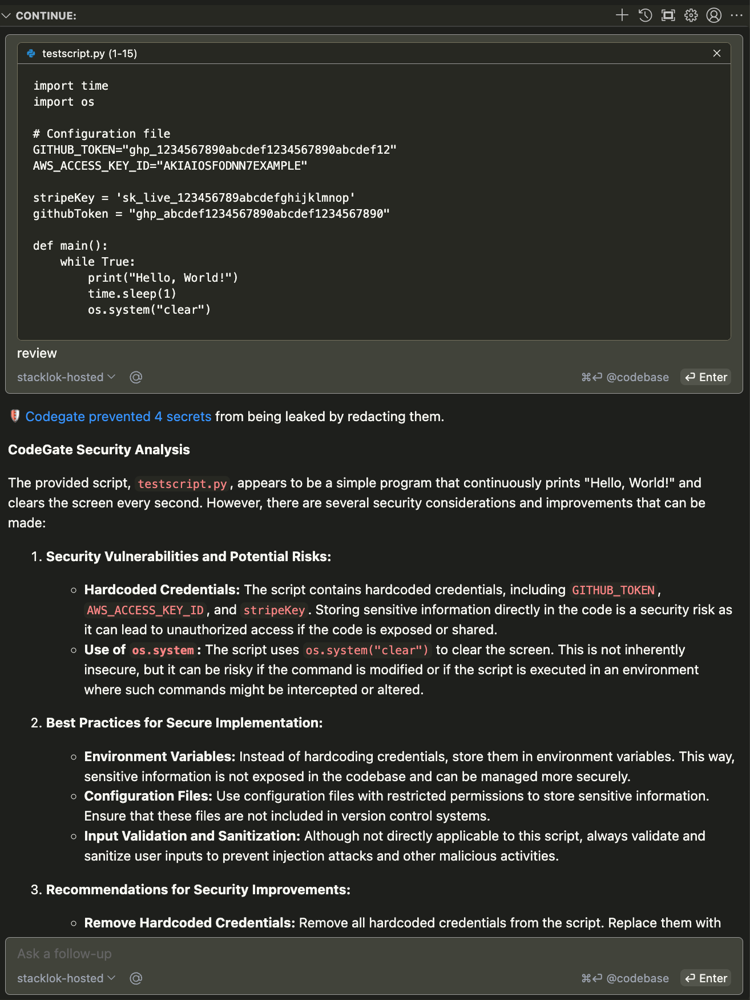

# Quick setup - Continue with VS Code

For complete documentation, see:

- [Quickstart guide - Continue](https://docs.codegate.ai/quickstart-continue)
- [Use CodeGate with Continue](https://docs.codegate.ai/how-to/use-with-continue)

## Prerequisites

- Visual Studio Code
- Access to a supported AI model provider:
  - Anthropic API
  - OpenAI API
  - A vLLM server in OpenAI-compatible mode
  - Ollama running locally

## Install the Continue extension

The Continue extension is available in the
[Visual Studio Marketplace](https://marketplace.visualstudio.com/items?itemName=Continue.continue).

Install the extension using the **Install** link on the Marketplace page or search
for "Continue" in the Extensions panel within VS Code.

You can also install from the CLI:

```bash
code --install-extension Continue.continue
```

Once you have installed the extension, you should be able to see the Continue
icon in the Activity Bar.



## Configure Continue to use CodeGate

To configure Continue to send requests through CodeGate:

1. Configure the [chat](https://docs.continue.dev/chat/model-setup) and [autocomplete](https://docs.continue.dev/autocomplete/model-setup) settings in Continue for your desired AI model(s).

2. Open the Continue [configuration file](https://docs.continue.dev/reference), "~/.continue/config.json". You can edit this file directly or access it from the gear icon ("Configure Continue") in the Continue chat interface. 

3. Add the "apiBase" property to the "models" entry (chat) and
   "tabAutocompleteModel" (autocomplete) sections of the configuration file.
   This tells Continue to use the CodeGate CodeGate container running locally on
   your system as the base URL for your LLM API, instead of the default.

   ```json
   "apiBase": "http://127.0.0.1:8989/PROVIDER"
   ```

   Replace /PROVIDER with one of: /anthropic, /ollama, /openai, or /vllm to
   match your LLM provider.

4. Save the configuration file.

### Examples

Example Continue chat configurations for Anthropic, OpenAI, Ollama, and vLLM:

```json
"models": [
    {
      "title": "CodeGate-Anthropic",
      "provider": "anthropic",
      "model": "claude-3-5-sonnet-latest",
      "apiKey": "YOUR_API_KEY",
      "apiBase": "http://localhost:8989/anthropic"
    },
    {
      "title": "CodeGate-OpenAI",
      "provider": "openai",
      "model": "gpt-4o",
      "apiKey": "YOUR_API_KEY",
      "apiBase": "http://localhost:8989/openai"
    },
    {
      "title": "CodeGate-Ollama",
      "provider": "ollama",
      "model": "codellama:7b-instruct",
      "apiBase": "http://localhost:8989/ollama"
    },
    {
      "title": "CodeGate-vLLM",
      "provider": "vllm",
      "model": "Qwen/Qwen2.5-Coder-14B-Instruct",
      "apiKey": "YOUR_API_KEY",
      "apiBase": "http://localhost:8989/vllm"
    }
  ],
```

For auto completion, add your model config to the tabAutoCompleteModel section
of the config.json file. Example for Anthropic:

```json
"tabAutocompleteModel": {
  "title": "CodeGate-Anthropic",
  "provider": "anthropic",
  "model": "claude-3-5-sonnet-latest",
  "apiKey": "YOUR_API_KEY",
  "apiBase": "http://localhost:8989/anthropic"
},
```

For more details, refer to the full
[CodeGate how-to guide for Continue](https://docs.codegate.ai/how-to/use-with-continue#configure-continue-to-use-codegate).

## Verify configuration

To verify that you've successfully connected Continue to CodeGate, open the
Continue chat and type "codegate-version". You should receive a response like
"CodeGate version 0.1.0".

You can now start using Continue as before, but with the added benefit extra
privacy and control over your data.



## Next steps

Explore the full [CodeGate docs](https://docs.codegate.ai), join the
[community Discord server](https://discord.gg/stacklok) to chat about the
project, and get involved on the
[GitHub repo](https://github.com/stacklok/codegate)!

## Support

If you need help, please ask for support on the Continue section of
[CodeGate discussions](https://github.com/stacklok/codegate/discussions/categories/continue)
or in the #codegate channel on [Discord](https://discord.gg/stacklok).
