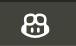
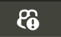

# Quick setup - GitHub Copilot with VS Code

For complete documentation, see:

- [Quickstart guide - GitHub Copilot](https://docs.codegate.ai/quickstart)
- [Use CodeGate with GitHub Copilot](https://docs.codegate.ai/how-to/use-with-copilot)

## Prerequisites

- An active GitHub account with a Copilot subscription
- Visual Studio Code with the Copilot extension installed

CodeGate works as an HTTP proxy to intercept and modify traffic between GitHub
Copilot and your IDE. You must run the CodeGate container with port 8990 mapped
and a persistent volume. If you did not launch it this way, stop and re-start
with the required settings:

```bash
docker stop codegate && docker rm codegate

docker run --name codegate -d -p 8989:8989 -p 9090:9090 -p 8990:8990 --mount type=volume,src=codegate_volume,dst=/app/codegate_volume --restart unless-stopped ghcr.io/stacklok/codegate:latest
```

## Trust the CodeGate CA certificate

To establish a secure end-to-end connection between your IDE and CodeGate, you
need to install CodeGate's generated CA certificate to your trust store.
Decrypted traffic stays on your local machine and never leaves the CodeGate
container unencrypted.

See the [Certificates page](/certificates) for full details and installation
instructions.

### Configure VS Code to proxy traffic through CodeGate

Update your VS Code configuration to use CodeGate as a proxy.

In VS Code, open the Command Palette (Cmd+Shift+P on macOS or Ctrl+Shift+P on
Windows) and search for the **Preferences: Open User Settings (JSON)** command.

Append the following settings to your configuration file (settings.json):

```json
{
  // ... Existing settings ... //

  // Note: you may need to add a comma after the last line of your existing settings if not already present

  "http.proxy": "https://localhost:8990",
  "http.proxyStrictSSL": true,
  "http.proxySupport": "on",
  "http.systemCertificates": true,
  "github.copilot.advanced": {
    "debug.useNodeFetcher": true,
    "debug.useElectronFetcher": true,
    "debug.testOverrideProxyUrl": "https://localhost:8990",
    "debug.overrideProxyUrl": "https://localhost:8990"
  }
}
```

## Verify configuration

In the bottom right section of VS Code you will see a small Copilot avatar:



If there is an error, an exclamation icon appears over the avatar:



If you encounter an error, click on the Copilot avatar and select "Show
Diagnostics". Post the text to the Copilot section of
[CodeGate discussions](https://github.com/stacklok/codegate/discussions/categories/copilot)

To verify that CodeGate is receiving Copilot traffic as expected, open the
Copilot chat and type "What do you know about CodeGate?". You should receive a
response that starts like this:

```plain title="Copilot chat"
CodeGate is a security-focused AI assistant designed to help with software
security, package analysis, and providing guidance on secure coding practices.

...
```

## Next steps

Explore the full [CodeGate docs](https://docs.codegate.ai), join the
[community Discord server](https://discord.gg/stacklok) to chat about the
project, and get involved on the
[GitHub repo](https://github.com/stacklok/codegate)!

## Support

If you need help, please ask for support on the Copilot section of
[CodeGate discussions](https://github.com/stacklok/codegate/discussions/categories/copilot)
or in the #codegate channel on [Discord](https://discord.gg/stacklok).
